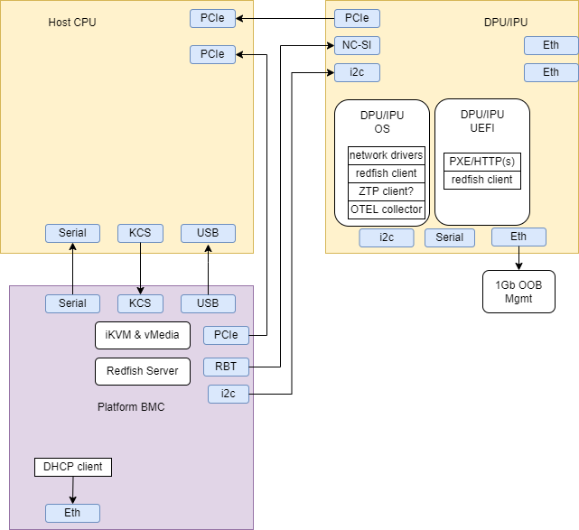
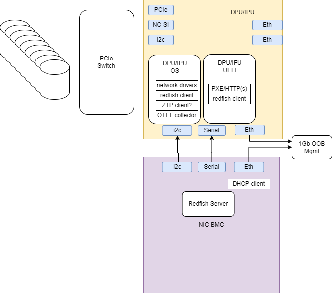
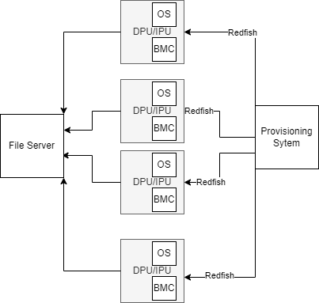

# Discovery and Provisioning

## Docs

- please look at <https://github.com/silicom-ltd/uBMC>
- please look at <https://opencomputeproject.github.io/onie/overview/>
- please look at <https://fidoalliance.org/intro-to-fido-device-onboard/>
- please look at <https://www.rfc-editor.org/rfc/pdfrfc/rfc8572.txt.pdf> (Secure Zero Touch Provisioning (SZTP))
- please look at <https://www.rfc-editor.org/rfc/pdfrfc/rfc8366.txt.pdf> (A Voucher Artifact for Bootstrapping Protocols)
- please look at <https://pypi.org/project/sztpd/>
- please look at <https://watsen.net/docs/sztpd/0.0.11/admin-guide/>
- please look at <https://nvlpubs.nist.gov/nistpubs/CSWP/NIST.CSWP.09082020-draft.pdf> (NIST)
- please look at <https://www.rfc-editor.org/rfc/rfc8995.html> (BRSKI)
- please look at <https://access.redhat.com/articles/6804281#install-assisted-installer-on-the-installer-node-using-podman-5>
- please look at <https://github.com/jparrill/ztp-the-hard-way> (RHEL)
- please look at <https://access.redhat.com/documentation/en-us/openshift_container_platform/4.9/html/scalability_and_performance/ztp-deploying-disconnected>
- please look at <https://cloud.redhat.com/blog/telco-5g-zero-touch-provisioning-ztp>
- please look at <https://edk2-docs.gitbook.io/getting-started-with-uefi-https-boot-on-edk-ii/introduction>
- please look at <https://github.com/sonic-net/SONiC/blob/master/doc/ztp/ztp.md>
- please look at <https://docs.openstack.org/ironic/latest/index.html>

## Definitions

| Name                | Details                                                                                             |
|---------------------|-----------------------------------------------------------------------------------------------------|
| Server platform     | The main computer unit (a.k.a. server), x86-based. Interconnects and controls the PCIe peripherals. |
| Server BMC          | Independent controller embedded in the server platform. Controls the server’s HW/FW configuration, initialization, health, lifecycle, and more. |
| Host OS             | The general-purpose operating system running on the server platform. |
| Host BIOS/UEFI      | Low-level software that starts after power on before booting your operating system. |
| DPU/IPU             | A PCIe performance NIC with a programmable CPU complex. |
| DPU/IPU firmware    | Low-level control drivers provided by the DPU/IPU vendor. Runs underneath the DPU/IPU OS (e.g. NIC firmware, microcode, UEFI) |
| DPU/IPU OS          | The operating system running on the DPU/IPU's programmable CPUs. |
| DPU/IPU BMC         | Independent controller embedded in the DPU/IPU. Controls the DPU/IPU's HW/FW configuration, initialization, health, lifecycle, and more. |

## DPU HW Components

|              |    |
|--------------------------------------------------------------------------------|-------------------------------------------------------------------------|
|  |

## Inventory Query or Broadcast

see [Inventory](INVENTORY.md)

## Re-Provisioning

tbd... re-celling, faults...

## Manual Provisioning

Andy: Do we need to cover manual methods in our scope? Many, many methods...

### RSHIM custom Provisioning

NVIDIA has a manual provisioning process based on a virtual *-over-PCIe device set, called [RSHIM](https://github.com/Mellanox/rshim). RSHIM creates, among other things, a virtual point-to-point ethernet device, and a virtual console device, between host and DPU/IPU. See also [usage](https://docs.nvidia.com/networking/display/BlueFieldDPUOSLatest/Deploying+DPU+OS+Using+BFB+from+Host) of RSHIM.
Many customers are using this process to deploy their own OS image and initialize system configuration, since they trust the OS running on the x86 host.

## Automatic Provisioning

We call "Automatic Provisioning" a provisioning process that is usually one that is automated by the environment and/or control plane, and doesn't involve a human operator's direct involvement (in e.g. plugging in a USB drive or a laptop via an ethernet/console cable)

### Externally-initiated

Provisioning can be triggered by an external actor, usually via BMC.

#### DPU BMC

DPU can receive commands via its BMC (using IPMI, RedFish etc.) to change boot order to PXE boot, and then to boot.

#### Platform BMC

The interaction from the previous section can also be applied using a trusted network connection between platform BMC and NIC BMC (using [NCSI](https://en.wikipedia.org/wiki/NC-SI)). In this scenario,  the platform BMC is able to interact with the NIC BMC without any involvement of, or placing trust in, an OS running on the host. One could send custom OEM commands over NC-SI to the BMC, or have a RedFish client on DPU receive commands from RedFish server on the platform BMC.

#### USB/Virtual media Provisioning

Note: This is typically a manual method, enabled by a one-to-one interaction with a BMC.

Use case: small scale, unique, specialized deployments ?



- Provisioning server contacts xPUs BMC (i.e. via redfish)
  - Question: how can we get list of IPs / MACs and credentials ? Manual ?
  - Question: Where to get credentials for redfish https ?
  - Question: can we also do the DHCP discovery of the BMC and initiate the provisioning from the BMC itself ?
- Provisioning server changes boot order of the xPU

```text
PATCH https://<bmc_ip_address>/redfish/v1/Systems/1
{
   "Boot" : {
      "BootSourceOverrideMode" : "Legacy",
      "BootSourceOverrideTarget" : "Hdd",
      "BootSourceOverrideEnabled" : "Once",
      "UefiTargetBootSourceOverride" : null
   },
   "HostWatchdogTimer" : {
      "FunctionEnabled" : true
   },
   "AssetTag": "asset tag",
   "IndicatorLED": "Lit"
}
```

- Provisioning server maps Virtual Media with ISO image to provision, see <https://github.com/openbmc/docs/blob/master/designs/virtual-media.md>

```text
POST https://<bmc_ip_address>/redfish/v1/Managers/bmc/VirtualMedia/CD/Actions/VirtualMedia.InsertMedia
{
"Image": "http://<web_server>/<image_name>.iso"
}
```

- Call script to start installation from mounted image
  - Question: how do we know what is the script name ? probably different for each Image...
- Provisioning server causes reboot after or xPU reboots itself

```text
POST https://<bmc_ip_address>/redfish/v1/Systems/1/Actions/ComputerSystem.Reset
{
    "ResetType" : "ForceRestart"
}
```

### Passive (ZTP/SZTP)

See [ZTP](ZTP.md)

## TBD

tbd
