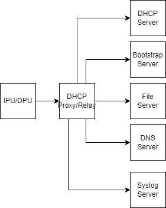
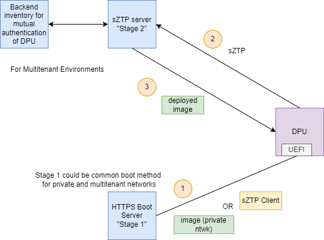
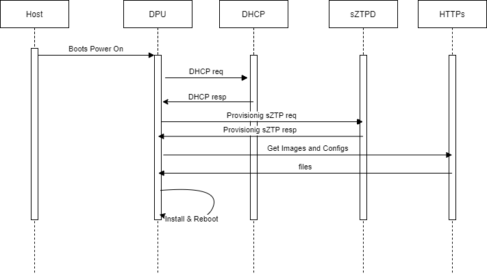

# Discovery and Provisioning

## Docs

- please look at <https://github.com/silicom-ltd/uBMC>
- please look at <https://opencomputeproject.github.io/onie/overview/>
- please look at <https://fidoalliance.org/intro-to-fido-device-onboard/>
- please look at <https://www.rfc-editor.org/rfc/pdfrfc/rfc8572.txt.pdf> (Secure Zero Touch Provisioning (SZTP))
- please look at <https://www.rfc-editor.org/rfc/pdfrfc/rfc8366.txt.pdf> (A Voucher Artifact for Bootstrapping Protocols)
- please look at <https://pypi.org/project/sztpd/>
- please look at <https://watsen.net/docs/sztpd/0.0.11/admin-guide/>
- please look at <https://nvlpubs.nist.gov/nistpubs/CSWP/NIST.CSWP.09082020-draft.pdf> (NIST)
- please look at <https://www.rfc-editor.org/rfc/rfc8995.html> (BRSKI)
- please look at <https://access.redhat.com/articles/6804281#install-assisted-installer-on-the-installer-node-using-podman-5>
- please look at <https://github.com/jparrill/ztp-the-hard-way> (RHEL)
- please look at <https://access.redhat.com/documentation/en-us/openshift_container_platform/4.9/html/scalability_and_performance/ztp-deploying-disconnected>
- please look at <https://cloud.redhat.com/blog/telco-5g-zero-touch-provisioning-ztp>
- please look at <https://edk2-docs.gitbook.io/getting-started-with-uefi-https-boot-on-edk-ii/introduction>
- please look at <https://github.com/sonic-net/SONiC/blob/master/doc/ztp/ztp.md>
- please look at <https://docs.openstack.org/ironic/latest/index.html>

## Definitions

| Name                | Details                                                                                             |
|---------------------|-----------------------------------------------------------------------------------------------------|
| Server platform     | The main computer unit (a.k.a. server), x86-based. Interconnects and controls the PCIe peripherals. |
| Server BMC          | Independent controller embedded in the server platform. Controls the server’s HW/FW configuration, initialization, health, lifecycle, and more. |
| Host OS             | The general-purpose operating system running on the server platform. |
| Host BIOS/UEFI      | Low-level software that starts after power on before booting your operating system. |
| DPU/IPU             | A PCIe performance NIC with a programmable CPU complex. |
| DPU/IPU firmware    | Low-level control drivers provided by the DPU/IPU vendor. Runs underneath the DPU/IPU OS (e.g. NIC firmware, microcode, UEFI) |
| DPU/IPU OS          | The operating system running on the DPU/IPU's programmable CPUs. |
| DPU/IPU BMC         | Independent controller embedded in the DPU/IPU. Controls the DPU/IPU's HW/FW configuration, initialization, health, lifecycle, and more. |

## DPU HW Components

|              |    |
|--------------------------------------------------------------------------------|-------------------------------------------------------------------------|
|  |

## Inventory Query or Broadcast

see [Inventory](INVENTORY.md)

## Re-Provisioning

tbd... re-celling, faults...

## Manual Provisioning

Andy: Do we need to cover manual methods in our scope? Many, many methods...

### RSHIM custom Provisioning

NVIDIA has a manual provisioning process based on a virtual *-over-PCIe device set, called [RSHIM](https://github.com/Mellanox/rshim). RSHIM creates, among other things, a virtual point-to-point ethernet device, and a virtual console device, between host and DPU/IPU. See also [usage](https://docs.nvidia.com/networking/display/BlueFieldDPUOSLatest/Deploying+DPU+OS+Using+BFB+from+Host) of RSHIM.
Many customers are using this process to deploy their own OS image and initialize system configuration, since they trust the OS running on the x86 host.

## Automatic Provisioning

We call "Automatic Provisioning" a provisioning process that is usually one that is automated by the environment and/or control plane, and doesn't involve a human operator's direct involvement (in e.g. plugging in a USB drive or a laptop via an ethernet/console cable)

### Externally-initiated

Provisioning can be triggered by an external actor, usually via BMC.

#### DPU BMC

DPU can receive commands via its BMC (using IPMI, RedFish etc.) to change boot order to PXE boot, and then to boot.

#### Platform BMC

The interaction from the previous section can also be applied using a trusted network connection between platform BMC and NIC BMC (using [NCSI](https://en.wikipedia.org/wiki/NC-SI)). In this scenario,  the platform BMC is able to interact with the NIC BMC without any involvement of, or placing trust in, an OS running on the host. One could send custom OEM commands over NC-SI to the BMC, or have a RedFish client on DPU receive commands from RedFish server on the platform BMC.

#### USB/Virtual media Provisioning

Note: This is typically a manual method, enabled by a one-to-one interaction with a BMC.

Use case: small scale, unique, specialized deployments ?


- Provisioning server contacts xPUs BMC (i.e. via redfish)
  - Question: how can we get list of IPs / MACs and credentials ? Manual ?
  - Question: Where to get credentials for redfish https ?
  - Question: can we also do the DHCP discovery of the BMC and initiate the provisioning from the BMC itself ?
- Provisioning server changes boot order of the xPU

```text
PATCH https://<bmc_ip_address>/redfish/v1/Systems/1
{
   "Boot" : {
      "BootSourceOverrideMode" : "Legacy",
      "BootSourceOverrideTarget" : "Hdd",
      "BootSourceOverrideEnabled" : "Once",
      "UefiTargetBootSourceOverride" : null
   },
   "HostWatchdogTimer" : {
      "FunctionEnabled" : true
   },
   "AssetTag": "asset tag",
   "IndicatorLED": "Lit"
}
```

- Provisioning server maps Virtual Media with ISO image to provision, see <https://github.com/openbmc/docs/blob/master/designs/virtual-media.md>

```text
POST https://<bmc_ip_address>/redfish/v1/Managers/bmc/VirtualMedia/CD/Actions/VirtualMedia.InsertMedia
{
"Image": "http://<web_server>/<image_name>.iso"
}
```

- Call script to start installation from mounted image
  - Question: how do we know what is the script name ? probably different for each Image...
- Provisioning server causes reboot after or xPU reboots itself

```text
POST https://<bmc_ip_address>/redfish/v1/Systems/1/Actions/ComputerSystem.Reset
{
    "ResetType" : "ForceRestart"
}
```

### Passive (ZTP/SZTP)

Passive reprovisioning is a process where DPUs start up and detect that they need to be re-provisioned. One such example might ostensibly be a DPU being fresh out of the factory and lacks an initial OS.

#### What is ZTP

Zero Touch Provisioning (ZTP) allows you to provision new DPU/IPU devices in your network automatically, with minimal manual intervention. This includes system software, operating system, patch files, and configuration files.

You can use either management ports or network ports, depending on your device, to connect to the network.

ZTP solves deploy at scale and reduce labor cost of manual intervention.

#### What is sZTP

see <https://www.rfc-editor.org/rfc/pdfrfc/rfc8572.txt.pdf>

Secure Zero Touch Provisioning (SZTP) adds a bootstrap server to DHCP-based ZTP deployment scenarios and uses two-way authentication and data encryption to secure ZTP data.

#### Components of ZTP deployment



- DPU/IPU device: new shipped device that is physically connected and powered but missing config and needs provisioning. Runs sZTP agent/client and uses DHCP client for deployment.
- DHCP server (optional): allocates a temporary IP address, default gateway, DNS server address, and bootstrap server IP or URL to the device to be deployed using sZTP. Some customers don't use DHCP, so either mDNS or static IP address allocation is applied.
- DHCP relay agent (optional): needed only when device and DHCP server are located on different network segments.
- Bootstrap server: Main server in sZTP deploy process. Responsible for mutual validation/trust first. Then sends File Server IP and Image URLs to the device to download in a secure way.
- Deployment file server (optional): can be co-located with bootsrap server, but for scalability (maybe with load balancer) should be separate. Holds deploy image files and config files that devices can download securely (HTTPS) after redirection from Bootsrap Server.
- DNS server (optional): maps domain names to IP addresses (for example bootstrap server and Deployment file server IPs).
- Syslog server (optional): holds/collects logs during the sZTP process.

#### sZTP process



Question: how to call it PXE ? iPXE ? HTTPs?
Use case: large scale deployments (where automation and security are major drivers) ?



##### Discovery

- Device is powered on
  - Question: how? BMC ? Always on?
- Device runs DHCP client to send a DHCP request packet to the DHCP server.
  - Question: DHCP client runs from Linux or from UEFI ?
  - Question: Is DHCP can be assumed ? What else mDNS? Static IP ? Mac ?
  - Question: Is DHCP relay required ? in case we are on the different network ?
- DHCP server assigns an IP address, a default gateway, and the IP address or domain name of the "Bootstrap Server" to the device.
  - Need new custom DHCP option for OPI (similar to SONiC)
  - Question: is "Bootstrap Server" in the cloud ? local in datacenter ? remote ? vm/container ?
  - Comment: probably need to support multiple preferences by operators. some facilities have to be actually local, other can be proxied to a centralized location, others yet can be completely centralized without a local presence.
- Need to consider mDNS as another option if DHCP is absent.
- Need to consider LLDP/SSDP as well.

##### Network trusts DPU

- Device establishes an HTTPS connection with the "Bootstrap Server"
  - Question: using what certificates?
  - More info is here <https://github.com/opiproject/opi-prov-life/blob/main/architecture/Zero-Touch-Provisioning%E2%80%94Approaches-to-Network-Layer-Onboarding.pdf>
- Device sends a request to a "Bootstrap Server" to join the network by providing its IDevID.
- "Bootstrap Server" decides to accept debvice to the network or reject
  - Needs trust anchor of IDevID
  - Takes "Voucher Server" URL from IDevID
    - <https://www.rfc-editor.org/rfc/pdfrfc/rfc8366.txt.pdf> (A Voucher Artifact for Bootstrapping)
  - Fetches Voucher with trust anchor of IDevID inside the voucher
  - Verifies IDevID and accepts Device to the network

##### DPU trusts network

- Device has to decide to trust/join the network now
  - Device asks "Bootstrap Server" to give a Voucher
  - Device starts Voucher verification
    - Device verifies the signature of the voucher
    - Device verifies IDevID from the Voucher belongs to the device
    - Device verifies the correctness of the network by comparing Voucher network root certificate to TLS certificate from the initial connection to the "Bootstrap Server"
  - Device trusts the network now
- Device needs LDevID (crypto identity in the local domain)
  - Device asks "Bootstrap Server" to get "CA Server" address
  - Device generates keypair and CSR
  - Device sends CSR to "CA Server" (SCEP -Simple Certificate Enrollment Protocol)
  - "CA Server" returns certificate to the Device
  - Device has now cryptograhic identity in the lcoal domain
- Question: three-way trust established here, between device identity, manufacturer, and operator ???

##### FW and Config and OS images

- Bootstrap server can/should point to deployment file server
  - for operational and scaling purposes they should probably be separate.
  - There are some scaling requirements on the deployment file server where the implementation details can really drive the pattern of redirection between boot and deployment file servers (for instance, you can avoid having to deploy a load balancer in front of deployment file servers by the boot server spreading the load over multiple DNS names).
- Device performs one-two-three-way authentication with the deployment file server and establishes an HTTPS connection with the deployment file server
  - Question: same as above
- Device downloads the system software, configuration file, and so on...
  - Question: bootstrap server can point to deployment file server? or they are the same?
- Device reboots into newly installed software
  - Question: if the version is the same, can the entire process skip ? where this happens?

Do we want to favor UEFI methods (like HTTPS boot) over others that require a client running in an OS, or a BMC (like sZTP)?

Two overarching scenarios:

1) private network; security provided by physical isolation
2) multi-tenant environment; mutual authentication with device and provisioning server will be essential

#### sZTP Configuration

This section shows what ZTP commands are supported on DPU/IPUs:

- `ztp status --verbose`
  - Use the verbose option to display more detailed information.
  - Agent/Service run status
  - Agent/Service run version
  - Completion status / failures
  - DHCP interfaces and options
  - times (start and run)
  - File downloads status
  - Mutual trust verification status (i.e iDevID and Vouchers)

- `ztp enable`
  - By default ZTP is on, use this comamnd if you disabled the service manually.

- `ztp disable`
  - Stop and Disable the ZTP service. If the ZTP service is in progress, it is aborted (SIGTERM)

- `ztp run`
  - Use this command to manually restart a new ZTP session

## Progress / Monitoring / Debugging

- sZTP should have an option to be started in advanced debug mode to produce more verbose information on steps being performed.

- Monitoring/Status of provisioning incliudes for each device:
  - Starting and ending times of ZTP process.
  - Lists of bound and unbound DHCP client interfaces.
  - DHCP options that DHCP servers send to DHCP clients.
  - Logs indicating which interfaces are used for ZTP.
  - ZTP parameters that DHCP clients obtain from DHCP servers.
  - Filenames of configuration and image files, names of file servers, protocols used to fetch files, and times when DHCP servers fetch configuration and image files.
  - Complettion of both Mutual Trust Authentications (i.e iDevID and Vouchers) and resons for failure.
  - Failure states caused by files not being on servers, or unreachable servers, and time outs.
  - Number of attempts made, and number of attempts remaining, for retry in current ZTP cycle.
  - Completion of file transfers.
  - Installation, reboot, and state of ZTP process.
  - Internal state errors and termination of ZTP process.
  - Logs for when default routes were added or deleted.

Question: how this is implemented and integrated with existing provisioning services?
Question: OPI can produce an agent (container) that runs on DPU/IPU for example and collects all this information via redfish, ipmi, lspci, and other specialized tools... And then exposes single common endpoint API so everybody can query it... like MAAS, JESP, RHEL SAAS and so on...

## What OPI produces?

- OPI can produce secure provisioning server/vm/container that follows some well defined SPEC
- Any other implementation of the secure provisioning server/vm/container is also acceptable if follows same SPEC
- xPU vendors will adopt their implementation to meet this secure provisioning server/vm/container
- Provisioning companies/customers will use API defined to the secure provisioning server/vm/container to integrate in their existing provisioning methods
- Another option would be to actually implement a generic *client* to consume this SPEC/protocol and facilitate provisioning. Obviously there will be parts of the provisioning process that are propiertary, but surely most of it can be vendor-agnostic, based on the spec.

- OPI can also produce an agent (container/service) for Standard Inventory Query that everybody (existing provisioning systems) can query

what is the adoption rate of UEFI on DPU/IPUs? Should it be relied upon?

## TBD

tbd
